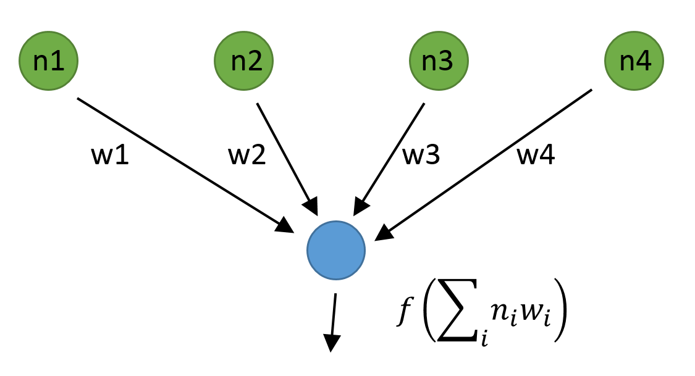

- title : F# via machine learning
- description : In this presentation we look at the task of classifying natural languages using two
     machine learning algorithms: nearest neighbour classification, and logistic regression.
- author : Evelina Gabasova
- theme : white
- transition : none

****************************************************************************************************

# Machine Learning

##  with Functional Programming and F# 

 

Evelina Gabasova ([@evelgab](http://www.twitter.com/evelgab))  

----------------------------------------------------------------------------------------------------

# F# for Machine Learning

_"F# empowers users to tackle complex computing problems with simple, maintainable and robust code."_

 

## What this really means

 - Can implement complex ML algorithms
 - Code is easy to understand
 - We can integrate it with .NET

----------------------------------------------------------------------------------------------------

# Recognizing languages

 
----------------------------------------------------------------------------------------------------

<table><tr><td class="noborder">

# Recognizing languages

What is the language of this text?

 
 

*A Csillagok haboruja egy uropera filmsorozatnak, irodalmi muveknek es szamitogepes jatekoknak a neve.*

</td>
<td class = "noborder fragment">

**This is Hungarian, of course!**

</td>
</tr></table>

----------------------------------------------------------------------------------------------------

# What you won't learn 

- how to use machine learning frameworks

  

## What you will learn 

- how two important machine learning algorithms work
- how to implement them in F#

****************************************************************************************************

# PART 1
## Recognizing languages   using letter pair frequency

 

** [ NEAREST NEIGHBOUR CLASSIFIER ] **

 

----------------------------------------------------------------------------------------------------

# The plan

 - **Get sample text** from from Wikipedia pages (_done_) 
 
 - **Calculate features** frequencies of _letter pairs_
 
 - **Compare languages** using their _features_
 
 - **Classify language** find the _most similar_ one 
 

----------------------------------------------------------------------------------------------------

# STEP 1
## Calculating frequencies

Example using sample English text _"the three"_

 
<table><tr><td class="noborder">

+----+---+
| _t | 2 |
+----+---+
| th | 2 |
+----+---+
| he | 1 |
+----+---+

</td><td class="noborder">

+----+---+
| e_ | 2 |
+----+---+
| hr | 1 |
+----+---+
| re | 1 |
+----+---+

</td><td class="noborder">

+----+---+
| ee | 1 |
+----+---+

</td></tr></table>

----------------------------------------------------------------------------------------------------

# STEP 1
## Calculating frequencies

Now calculate _probabilities_ of the pairs

 
<table><tr><td class="noborder">

+----+------+
| _t | 0.2  |
+----+------+
| th | 0.2  |
+----+------+
| he | 0.1  |
+----+------+

</td><td class="noborder">

+----+------+
| e_ | 0.2  |
+----+------+
| hr | 0.1  |
+----+------+
| re | 0.1  |
+----+------+

</td><td class="noborder">

+----+------+
| ee | 0.1  |
+----+------+

</td></tr></table>

----------------------------------------------------------------------------------------------------

# STEP 2
## Calculating distance between features

+------------+-----+-----+-----+-----+
|            | th  | e_  | ee  | el  |
+------------+-----+-----+-----+-----+
| English    | 0.3 | 0.2 | 0.2 | 0.1 |
+------------+-----+-----+-----+-----+
| Portuguese | 0.0 | 0.2 | 0.1 | 0.3 |
+------------+-----+-----+-----+-----+

Distance is the _sum of squares of differences_.

----------------------------------------------------------------------------------------------------

# STEP 2
## Calculating distance between features

+------------+-----+-----+-----+------+
|            | th  | e_  | ee  | el   |
+------------+-----+-----+-----+------+
| English    | 0.3 | 0.2 | 0.2 | 0.1  |
+------------+-----+-----+-----+------+
| Portuguese | 0.0 | 0.2 | 0.1 | 0.3  |
+------------+-----+-----+-----+------+
| Difference | 0.3 | 0.0 | 0.1 | -0.2 |
+------------+-----+-----+-----+------+

_Sum of squares_: $0.09+0.0+0.01+0.04 = 0.14$

----------------------------------------------------------------------------------------------------

# STEP 3
## Classifying unknown text

+--------------+------------+---------+------------+-------+
|              | English    | Spanish | Portuguese | Czech |
+--------------+------------+---------+------------+-------+
| Unknown text | 0.10       | 0.14    | 0.25       | 0.27  |
+--------------+------------+---------+------------+-------+

----------------------------------------------------------------------------------------------------

# PART 1

## [github.com/evelinag/LanguageRecognizer](https://github.com/evelinag/LanguageRecognizer)

****************************************************************************************************

# PART 2
## Recognizing languages   using simple neural net

 

** [ PERCEPTRON ] **

** [ LOGISTIC REGRESSION ] **

----------------------------------------------------------------------------------------------------

# How neural networks work

----------------------------------------------------------------------------------------------------

# Network with single neuron

----------------------------------------------------------------------------------------------------

# Sigmoid function

$ f(x) = \frac{1}{1 + e^{-x}} $

----------------------------------------------------------------------------------------------------

# Learning the weights

 - **Initial weights** can be generated randomly
 
 - **Improve weights** using gradient descent
 
 - **Repeat recursively** until certain error or number of steps

----------------------------------------------------------------------------------------------------

# Improving using gradient descent

----------------------------------------------------------------------------------------------------

# Gradient descent in more dimensions

****************************************************************************************************

# Conclusions

## Learning more

---------------------------------------------------------------------------------------------------

# Learning more 

 - The F# Foundation [www.fsharp.org](http://www.fsharp.org)
 - FsLab Package [www.fslab.org](http://www.fslab.org)
 
 - Accord.NET [accord-framework.net](http://accord-framework.net/)
 - Diffsharp library [diffsharp.github.io/DiffSharp](http://diffsharp.github.io/DiffSharp/)
 - Hype library for deep learning [hypelib.github.io/Hype](http://hypelib.github.io/Hype/)
 - Vulpes: deep belief networks [github.com/fsprojects/Vulpes](https://github.com/fsprojects/Vulpes)
 
---------------------------------------------------------------------------------------------------

# Thank you!

<table>
<tr>
  <td class="noborder"></td>
  <td style="vertical-align:middle" class="noborder"> [@evelgab](https://twitter.com/evelgab)</td>
</tr>
<tr>
  <td class="noborder"></td>
  <td class="noborder" style="vertical-align:middle" > [evelina@evelinag.com](mailto:evelina@evelinag.com)</td>
</tr>
<tr>
  <td class="noborder"></td>
  <td class="noborder" style="vertical-align:middle" > [github.com/evelinag](https://github.com/evelinag)</td>
</tr>
<tr>
  <td class="noborder"></td>
  <td class="noborder" style="vertical-align:middle" > [evelinag.com](http://evelinag.com)</td>
</tr>
</table>